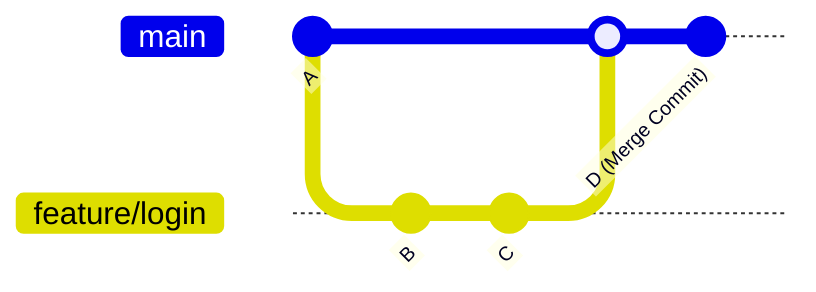

```python
import ollama
from IPython.display import display, Markdown
```

    1.43.0


## GitHub


```python
user_input = """
Give me a quick rundown on github flavored markdown. How to make buttons with icons e.g. react
"""

response = ollama.chat(
    model='gemma4',
    messages=[
        {
            'role': 'user', 
            'content': user_input  # Pass variable here
        }
    ]
)

# Render formatted Markdown instead of printing raw string
display(Markdown(response['message']['content']))
```


This is a common request because Markdown is primarily designed for **text structure**, not **visual design or interactive components**.

I will break this down into two sections: First, a quick rundown of GFM; second, the necessary workarounds for making buttons and icons.

***

## 📝 Part 1: GitHub Flavored Markdown (GFM) Rundown

GFM is simply an enhanced version of standard Markdown that adds features necessary for technical documentation—the most notable being **tables**, **task lists**, and advanced code block syntax highlighting.

### ✨ The Essential GFM Features

#### 1. Task Lists / Checkboxes (The Signature Feature)
Used for checklists, issue tracking, or feature lists.
```markdown
- [x] Complete initial setup
- [ ] Write documentation draft
- [ ] Review and publish
```
*Output:* ☑️ Complete initial setup, ☐ Write documentation draft

#### 2. Tables
Tables require using pipes (`|`) and hyphens (`---`). The first row of separators (the header separator) is crucial for syntax highlighting.
```markdown
| Feature | Status | Priority |
| :--- | :---: | ---: |
| Auth Module | Complete | High |
| Billing API | WIP | Medium |
| Dashboard UI | To Do | Low |
```

#### 3. Code Blocks (Crucial for Tech Docs)
This is the most powerful syntax feature. By adding an optional language name after three backticks (`` ` ``), GitHub can apply proper syntax highlighting.
**Syntax:**
```markdown
```language-name
// your code here
```
Example:
````markdown
```python
def greet(name):
    print(f"Hello, {name}")
```
````

#### 4. Formatting (Standard Markdown)
| Element | Syntax | Example Output |
| :--- | :--- | :--- |
| **Bold** | `**text**` or `__text__` | **Text Bold** |
| *Italics* | `*text*` or `_text_` | *Text Italic* |
| `Inline Code` | `` `code snippet` `` | `console.log()` |
| Headings | `# Heading 1`, `## H2` | Large text, smaller text |

***

## 🚀 Part 2: Making Buttons and Icons (The Limitation)

**🛑 The Critical Constraint:** Markdown is a *renderer*, not a styling language. It does not have native syntax for creating interactive elements (like functional buttons) or complex visual layouts using icons directly (outside of emojis).

When people ask to make "buttons" in Markdown, they are actually asking to write **HTML and CSS**, which GitHub supports embedding.

### ✅ The Solution: Using Embedded HTML and Font Awesome

The most reliable way to achieve a styled button with an icon is to drop down to basic HTML structure. Since you mentioned icons (like React components often use), I recommend using an external icon library like [Font Awesome](https://fontawesome.com/).

**Structure Breakdown:**

1.  Use an `<a>` tag for the link functionality.
2.  Use a `<button>` or styled `<span>` element to wrap and style the content.
3.  Embed the icon via its Font Awesome class (e.g., `fa-github`).

#### Example Code Block (Copy and Paste this):

This example creates a blue button that says "React" and has a tiny React logo icon next to it, linking somewhere specific.

```html
<a href="https://react.dev/" style="text-decoration: none;">
  <button 
    style="
      background-color: #61dafb; /* Light blue background */
      color: black; 
      padding: 8px 15px; 
      border: none; 
      border-radius: 4px; 
      cursor: pointer; 
      font-weight: bold;
      display: flex; /* Centers icon and text */
      align-items: center;
      gap: 8px; /* Space between icon and text */
    "
  >
    <!-- The Icon (Requires Font Awesome setup on your site) -->
    <i class="fab fa-react"></i> 
    React Docs
  </button>
</a>
```

### 💡 Summary for Implementation:

| Feature | Standard MD Approach | Advanced/Recommended Approach |
| :--- | :--- | :--- |
| **Simple Link** | `[Link Text](url)` | N/A |
| **Fake Button** | Use bold text, blockquotes, and emojis (`> *Click Here* ⭐️`) | Embed HTML button tag (`<a href="..."> <button>...</button> </a>`) |
| **Icon + Button**| Impossible with pure MD. | Requires **HTML embedding** plus an external icon library (Font Awesome). |

### Summary Takeaway:

If you want a functional, styled component like a modern "button," treat Markdown as just the container for your HTML structure. Use basic HTML tags (`<a>`, `<button>`, `<i>`) and apply styling with inline CSS (`style="..."`).


```python
user_input = """
Explain Github merge commit, squash and merge, and rebase and merge. and give examples when to use the options when making a pull request
"""

response = ollama.chat(
    model='gemma4',
    messages=[
        {
            'role': 'user', 
            'content': user_input  # Pass variable here
        }
    ]
)

# Render formatted Markdown instead of printing raw string
display(Markdown(response['message']['content']))
```


This is an excellent set of questions because understanding these three mechanisms—Merge Commit, Squash & Merge, and Rebase & Merge—is fundamental to maintaining a clean, professional codebase using Git.

All three methods achieve the goal of getting changes from a feature branch (e.g., `feature/login`) into a target branch (e.g., `main` or `develop`). However, they handle the *commit history* differently, and this difference dictates which one is best for a given situation.

Here is a detailed explanation of each method, followed by clear examples of when to use them.

---

## 🌳 1. Merge Commit (The Default / The Literal History)

### What it does?
A merge commit creates an explicit record in your repository history that states: "At this point in time, two lines of development were combined." It takes all the commits from your feature branch and simply stacks them onto the end of the target branch's history.

The resulting Git history is a non-linear graph because it has multiple points where branches diverged and reconverged.

### 🖼️ Visual Concept


### ✅ Pros & ❌ Cons

| Aspect | Description |
| :--- | :--- |
| **Pros** | *Accurate History:* It is the most accurate record of what happened—every step and change is preserved. Never loses information. |
| **Cons** | *Noisy History:* If your feature branch had 15 small, messy "WIP" (Work In Progress) commits, all 15 are preserved in `main`. This can make the history hard to read and confusing. |

***

## 🧺 2. Squash and Merge (The Cleanup / The Feature Bundle)

### What it does?
Instead of merging every single commit from your feature branch, "Squash and Merge" takes *all* the commits from the feature branch and combines them into **one single new commit**.

It is like wrapping up an entire feature's work into one clean package. The original messy commits on your feature branch are discarded from the target history.

### 🖼️ Visual Concept
(If your branch had B, C, D, E)


### ✅ Pros & ❌ Cons

| Aspect | Description |
| :--- | :--- |
| **Pros** | *Clean History:* The `main` branch history is kept pristine and linear. It makes it look like the entire feature was written in one go (which is often true from a user's perspective). |
| **Cons** | *Loss of Detail:* You lose the granular, incremental history. If an issue is found in this feature later, you can't easily pinpoint which specific commit (B vs C) introduced the bug without checking out the old branch. |

***

## 🔄 3. Rebase and Merge (The Rewrite / The Clean Line)

### What it does?
Rebasing is fundamentally about **rewriting history** to make it look like you started your feature branch from a more recent point of the target branch's history, rather than a fixed starting date.

When you use "Rebase and Merge," Git takes all the commits from your feature branch and reapplies them *one by one* on top of the latest commit of the target branch (`main`). It results in a perfectly linear, straight line of history.

**Key Difference:** Rebase is typically done *before* making the PR (by the developer), while merging happens when accepting the PR.

### 🖼️ Visual Concept
*(Assume `main` progressed from A to X while you worked on B, C)*

1. **Initial state:**
   ```mermaid
   gitGraph
       commit id: "A"
       branch feature/login
       checkout feature/login
       commit id: "B"
       commit id: "C"
   ```

2. **Main progresses (X) while you work on B and C.**

3. **Developer runs `git rebase main`:** Git discards B and C, moves the branch pointer, pulls X, then reapplies B' and C'.
   ```mermaid
   gitGraph
       commit id: "A"
       commit id: "X"
       checkout feature/login
       commit id: "B'"
       commit id: "C'" 
   ```

4. **Result (After Merge):** The new history is a straight line, preserving the incremental commits but ensuring they all appear to have happened *after* X.

### ✅ Pros & ❌ Cons

| Aspect | Description |
| :--- | :--- |
| **Pros** | *Perfectly Linear:* Creates the cleanest possible Git history, making it feel like a single straight development path. It retains the detailed commit steps (B', C'). |
| **Cons** | *Dangerous History Rewrite:* Because rebasing *rewrites* history (the commits B and C become B' and C'), you must be extremely careful. **Never rebase public or shared branches.** If multiple people rely on the original history, rewriting it will cause major problems for them. |

***

## 🚀 Summary Table & Decision Guide

| Feature | Merge Commit | Squash and Merge | Rebase and Merge |
| :--- | :--- | :--- | :--- |
| **Commit History** | Non-linear (Graph) | Linear (Single Point) | Perfectly Linear (Clean Line) |
| **Commits Preserved?** | Yes (All original commits) | No (Combined into one) | Yes (All individual commits) |
| **History Rewritten?** | No | No | Yes (The hardest one to grasp!) |
| **Best For** | Long-lived, stable branches; Auditing *how* the branch progressed. | Small features, fixes, or quick improvements where history clutter is feared. | Keeping `main` spotless while preserving commit detail. (Requires discipline). |

***

## 💡 When To Use Which Option (PR Decision Tree)

Your choice depends on how clean you want your history to be versus how much historical fidelity you need to retain.

### 🌟 Use Merge Commit When:
*   **You are working on a core, stable service/library:** If the order of commits and every step taken matters for troubleshooting (e.g., migrating databases or complex networking code).
*   **The history MUST be preserved exactly as it happened.**
*   **Your feature branch is large and represents distinct work items** that should all be visible in the final history graph.

### 🧹 Use Squash and Merge When:
*   **You are working on a simple UI element or bug fix:** (e.g., "Changed button color," "Fixed typo"). The internal process of your commits is messy, but the end result is clean.
*   **The goal is to make it look like the entire feature was added in one go.**
*   **You want a very clean `main` branch history**, and you don't care about tracking every single intermediate commit.

### 💎 Use Rebase and Merge When:
*(Developer should typically run `git rebase main` *before* submitting the PR.)*
*   **You have a long feature branch (multiple commits) but want to maintain detailed history without merge commits cluttering it.**
*   **The goal is perfection:** You want the linear cleanliness of Squash, but you need the commit detail of Merge.
*   ***Caution: Only use this on branches that nobody else has pulled from yet!***


```python

```
